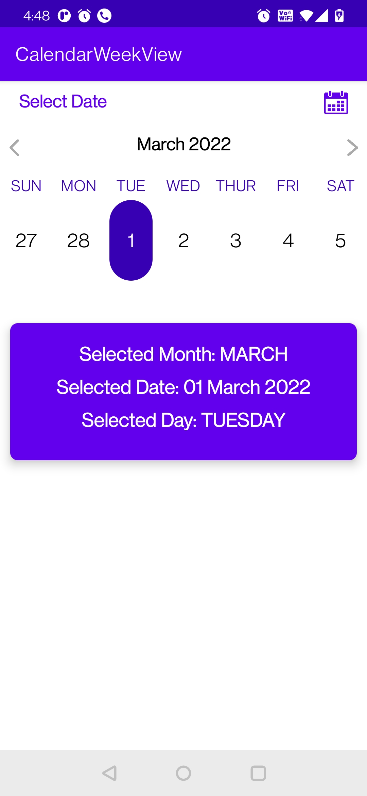

#Custom Calendar with Week View:

# Custom Calendar with Week View. User can navigate to next/previous week. User can click on any day to perform certain action

Developed using Kotlin. Features used:
1. Recyclerview with Grid Layout
2. Canlendar Utilities. Java Date, Java time.
3. View Binding
4. Date and time conversion routines.

App Screenshot:

    
    

     

